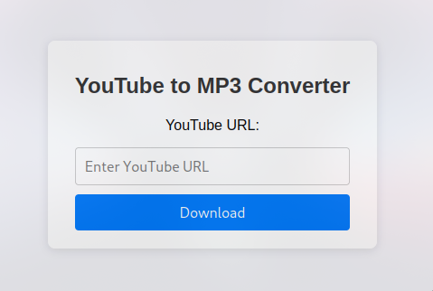

# YouTube to MP3 Converter

This is a simple web application built with Flask that allows you to convert YouTube videos to MP3 format.

## Features

- Convert YouTube videos to MP3 audio files.
- Simple and intuitive web interface.
- Uses `pytube` and `moviepy` libraries for video downloading and audio conversion.

## How It Works

1. **Enter YouTube URL:** Paste the URL of the YouTube video you want to convert.
2. **Download MP3:** Click on the "Download" button to convert and download the video as an MP3 file.
3. **Conversion Process:** The application downloads the video, extracts the audio, and provides the MP3 file for download.
